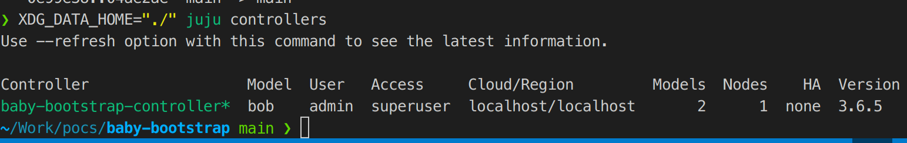

# Baby Bootstrap
This is a simple PoC that extracts the bootstrap process from the Juju CLI into a 
programmatic version.

Files:
- utils.go, you'll find extract and tweaked functions to make the process work.
- configs.go, you'll find the bootstrapConfigs extracted
- main.go, the process of bootstrapping, documented on a per-step basis.

## How to run it?
Simply run:
`go run .`

After which you'll have a `./juju/*` directory containing the configuration files
for the bootstrapped LXD controller.

To interact with said controller you can use (absolute or relative paths):
`XDG_DATA_HOME="/absolute/path/to/this/directory/baby-bootstrap" juju <command>`

`XDG_DATA_HOME="./" juju <command>`

